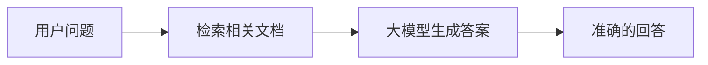

# AI Skill 赋能

## 前端开发者的自助创新革命

  
    开始探索 →
  

---

# 🤔 为什么需要 AI Skill？

## 前端开发者日常痛点

<v-clicks>

- **重复性工作**: 文档生成、代码模板、配置文件
- **上下文切换**: 在多个工具和平台间切换  
- **知识碎片化**: 需要整合多个来源的信息
- **交付压力**: 快速响应业务需求的挑战

</v-clicks>

<v-click class="mt-8">

> "我们不是要被 AI 替代，而是要用 AI 放大我们的能力"

</v-click>

---

# 🧠 AI 基础概念科普

## 大模型是什么？

<v-click>

**大模型 (LLM)** = 超级智能的代码补全工具 + 自然语言理解

- 训练数据: 海量文本数据
- 核心能力: 预测下一个词
- 应用场景: 问答、创作、编程、分析

</v-click>

<v-click class="mt-4">

**知名大模型家族**:

- **OpenAI**: GPT-4, GPT-4 Turbo (多模态能力强)
- **Anthropic**: Claude 3 系列 (长上下文, 安全性好)  
- **Google**: Gemini 1.5 (多模态, 上下文超长)
- **Meta**: LLaMA 系列 (开源, 社区活跃)
- **阿里**: Qwen 系列 (中文优化, 企业级)

</v-click>

---

# 🔧 核心技术概念

## RAG - 检索增强生成

<v-click>

**类比**: IDE 的智能文档查找功能

</v-click>

<v-click class="mt-4">

**应用场景**:
- 企业知识库问答
- 技术文档查询  
- 代码库智能搜索

</v-click>

---

# 🤖 Agent 与 Skill

## AI Agent 是什么？

<v-click>

**类比**: 自动化脚本 + 智能决策

- **理解目标**: 分析用户需求
- **规划步骤**: 制定执行计划  
- **调用工具**: 使用各种 Skill
- **处理结果**: 整合并输出

</v-click>

<v-click class="mt-4">

**编码相关的 Agent 工具**:

- **Claude Code**: Anthropic 的代码理解和生成
- **QCoder**: 阿里通义的代码生成工具
- **GitHub Copilot**: 微软的代码补全助手
- **CodeWhisperer**: AWS 的代码建议工具
- **Cursor**: AI 原生代码编辑器

</v-click>

---

# 🧩 Skill 与 MCP

## Skill 是什么？

<v-click>

**类比**: npm 包 / Vue 组件

- **封装功能**: 特定任务的逻辑封装
- **可复用**: 一次创建，多次使用
- **可组合**: 多个 Skill 协同工作

</v-click>

<v-click class="mt-4">

**MCP (Model Context Protocol)**:

**类比**: REST API / GraphQL

标准化的模型-工具通信协议

</v-click>

<v-click class="mt-4">

**典型 MCP 工具**:

- **LangChain Tools**: 丰富的工具集成
- **LlamaIndex**: 数据检索和查询
- **MCP Server**: 通用 MCP 服务框架
- **Custom MCP**: 自定义工具集成

</v-click>

---

# 🌟 优秀 Skill 实践案例

## 团队内可借鉴的成功案例

<v-clicks>

- **Slidev 演示文稿生成**: 自动创建技术分享演示文稿
- **GitHub 仓库管理**: 自动化代码仓库维护和文档生成  
- **大模型应用洞察**: 自动生成大模型发展脉络和对比分析
- **前端工具链集成**: 自动化开发环境配置和部署流程

</v-clicks>

<v-click class="mt-6">

> "每个 Skill 都是团队的知识资产和效率倍增器"

</v-click>

---

# 🛠️ 如何创建你的第一个 Skill？

## 完整开发流程

<v-clicks>

1. **需求分析**: 识别适合做成 Skill 的场景
2. **结构设计**: SKILL.md + 脚本 + 模板
3. **交互设计**: 用户友好的命令行界面
4. **错误处理**: 健壮的异常处理机制
5. **测试验证**: 本地测试和集成测试

</v-clicks>

<v-click class="mt-6">

**技能即服务**: 你的 Skill 可以帮助整个团队！

</v-click>

---

# ✅ 如何验证 Skill 效果？

## 质量评估标准

<v-clicks>

- **功能验证**: 确保按预期工作
- **用户体验**: 交互流程是否顺畅
- **性能测试**: 执行效率和资源使用
- **价值评估**: 带来的实际效益
- **迭代优化**: 基于反馈持续改进

</v-clicks>

<v-click class="mt-6">

> "好的 Skill 应该让复杂变简单，让重复变自动化"

</v-click>

---

# 🚀 行动号召

## 开始你的 AI Skill 之旅

<v-clicks>

- **今天**: 识别一个重复性工作场景
- **明天**: 创建你的第一个 Skill 原型
- **本周**: 在团队内分享和验证
- **未来**: 构建团队的 AI Skill 生态系统

</v-clicks>

<v-click class="mt-8">

### 🎯 你的目标
**从需求开发者 → Skill 创造者 → 团队赋能者**

</v-click>

---

# 💬 Q&A

## 问题与讨论

  

    <h3>技术问题</h3>
    
如何开始？需要什么技术栈？

  

  

    <h3>应用场景</h3>
    
哪些场景最适合做 Skill？

  

  

    <h3>团队协作</h3>
    
如何在团队中推广和维护？

  

  

    <h3>未来发展</h3>
    
AI Skill 的演进方向？

  

---

# 🙏 感谢聆听！

## 让我们一起构建 AI 时代的前端开发新范式

  🚀 立即行动，成为团队的 AI Skill 先锋！

[GitHub Repository](https://github.com/teeeemoji/claw)