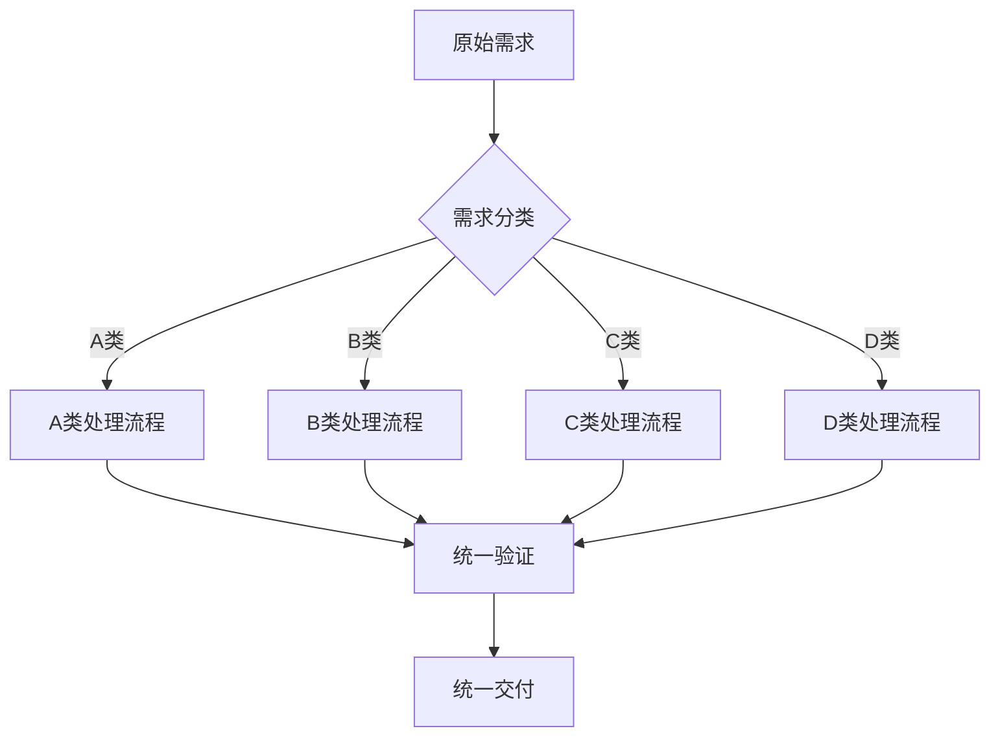

# AI Skill SDD 前端开发实践

基于 AI Skills 的端到端 SDD 开发模式

  
    Press Space for next page <carbon:arrow-right class="inline"/>
  

---

# 需求分类体系

## 四类前端需求
<v-clicks>

- **A类 - 无UI/UX需求**
  - 文案调整、逻辑开关、配置变更
  - 占比：30-40%

- **B类 - 轻量级UI需求**  
  - 样式微调、布局优化、交互增强
  - 占比：25-35%

- **C类 - 中等复杂度需求**
  - 新功能模块、存量重构、性能优化  
  - 占比：20-30%

- **D类 - 高复杂度需求**
  - 全新产品、架构升级、跨平台适配
  - 占比：10-15%

</v-clicks>

---

# A类需求：详细流程

## 输入输出规范
<v-clicks>

### 需求智能分类
- **输入**: 原始需求描述 + 项目上下文
- **输出**: 需求类型标签 + 处理策略

### 影响范围分析  
- **输入**: 分类后的需求 + 代码库结构
- **输出**: 影响文件列表 + 风险点标识

### 文案定位
- **输入**: 需要修改的文案 + 代码库
- **输出**: 精确文件路径 + 行号

### 智能替换
- **输入**: 定位结果 + 新文案
- **输出**: 修改后的代码 + 差异对比

### 差异验证
- **输入**: 生成的代码差异
- **输出**: 验证状态 + 问题警告

### 自动提交
- **输入**: 验证通过的修改
- **输出**: Git 提交 + PR（可选）

</v-clicks>

---

# B类需求：轻量级UI

## 核心流程
<v-clicks>

### 设计意图理解
- **输入**: 设计标注/口头描述 + 现有组件库
- **输出**: 样式变更清单 + 组件影响分析

### 样式智能提取
- **输入**: 设计系统规范 + 当前样式
- **输出**: CSS 变量/Token 映射 + 主题兼容性

### 组件定位与修改
- **输入**: 样式变更清单 + 代码库
- **输出**: 目标组件列表 + 修改建议

### 视觉回归测试
- **输入**: 修改后的组件 + 基准截图
- **输出**: 视觉差异报告 + 通过/失败状态

### 自动化部署
- **输入**: 验证通过的修改
- **输出**: 部署包 + 预览链接

</v-clicks>

## 典型场景
- 颜色主题切换
- 字体大小调整  
- 间距优化
- 动画效果增强

---

# C类需求：中等复杂度

## 核心流程
<v-clicks>

### 设计解析与拆解
- **输入**: 完整设计稿 + 业务需求
- **输出**: 组件树 + 状态管理方案

### 组件智能生成
- **输入**: 组件规格 + 技术栈约束
- **输出**: 可运行组件代码 + 类型定义

### 逻辑集成
- **输入**: 业务逻辑 + 现有架构
- **输出**: 集成代码 + API 调用

### 测试用例生成
- **输入**: 组件代码 + 业务规则
- **输出**: 单元测试 + E2E 测试

### Pull Request 创建
- **输入**: 完整实现 + 测试覆盖
- **输出**: PR + 代码审查清单

</v-clicks>

## 典型场景
- 新功能页面开发
- 现有模块重构
- 性能优化实施

---

# D类需求：高复杂度

## 核心流程
<v-clicks>

### 架构设计评审
- **输入**: 产品需求 + 技术约束
- **输出**: 架构方案 + 技术选型

### 模块拆分规划
- **输入**: 架构方案 + 团队能力
- **输出**: 模块划分 + 依赖关系

### 并行开发协调
- **输入**: 模块规划 + 开发资源
- **输出**: 开发计划 + 接口定义

### 集成测试策略
- **输入**: 模块实现 + 集成点
- **输出**: 测试方案 + 质量门禁

### 发布部署管理
- **输入**: 集成完成的系统
- **输出**: 发布包 + 监控配置

</v-clicks>

## 典型场景
- 全新 Web 应用
- 微前端架构迁移
- 多端统一解决方案

---

# 统一处理框架

## 智能路由机制

## 能力复用
<v-clicks>

- **共享组件库**: 所有类别共用
- **测试基础设施**: 统一测试框架
- **部署流水线**: 标准化部署流程
- **监控告警**: 统一监控体系

</v-clicks>

---

# AI Skill 列表

## 基础层 Skill
- 文案替换 Skill
- 配置修改 Skill  
- 样式调整 Skill
- 逻辑开关 Skill

## 进阶层 Skill
- 组件复用 Skill
- 设计解析 Skill
- 测试生成 Skill
- 性能诊断 Skill

## 高级层 Skill
- 架构分析 Skill
- 迁移辅助 Skill
- 并行协调 Skill
- 质量门禁 Skill

---

# 团队协作建设

## Skill 贡献流程
1. **需求识别**: 发现重复性工作
2. **Skill 设计**: 定义输入输出接口
3. **开发实现**: 编写 Skill 脚本和文档
4. **测试验证**: 本地测试和集成测试
5. **提交评审**: PR 提交和团队评审
6. **发布使用**: 合并到主分支并推广

## 质量标准
- **可靠性**: 99%+ 成功率
- **安全性**: 无破坏性操作
- **可维护性**: 清晰的文档和注释
- **可扩展性**: 支持参数化配置

---

# 实际案例展示

## 案例1: 电商产品页优化 (A+B类)
- **需求**: 更新促销文案 + 调整按钮样式
- **处理**: 文案替换 Skill + 样式调整 Skill
- **结果**: 5分钟完成，零人工干预

## 案例2: 用户管理后台 (C类)  
- **需求**: 新增用户角色管理功能
- **处理**: 设计解析 → 组件生成 → 逻辑集成
- **结果**: 2天完成，包含完整测试覆盖

## 案例3: 移动端适配项目 (D类)
- **需求**: 将 Web 应用适配到移动端
- **处理**: 架构分析 → 模块拆分 → 并行开发
- **结果**: 3周完成，支持多端统一

---

# 行动号召

## 立即开始
1. **识别机会**: 找出团队中的重复性工作
2. **选择起点**: 从 A 类需求开始试点
3. **创建第一个 Skill**: 实现简单的文案替换
4. **分享经验**: 在团队内推广成功案例

## 长期愿景
- **AI Skill 生态**: 团队共建共享的 Skill 库
- **开发效率提升**: 80%+ 的重复工作自动化
- **创新加速**: 释放开发者创造力
- **质量保证**: 标准化和自动化确保质量

## 资源支持
- **知识库**: https://github.com/teeeemoji/claw
- **模板**: Skill 创建模板和最佳实践
- **社区**: 团队内部 Skill 分享会
- **工具**: 完整的开发和测试工具链

---

# 谢谢！

开始你的 AI Skill 开发之旅吧！🚀

[GitHub Repository](https://github.com/teeeemoji/claw)