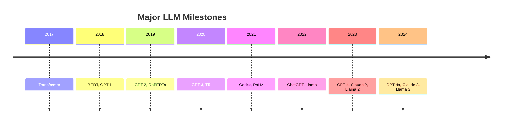
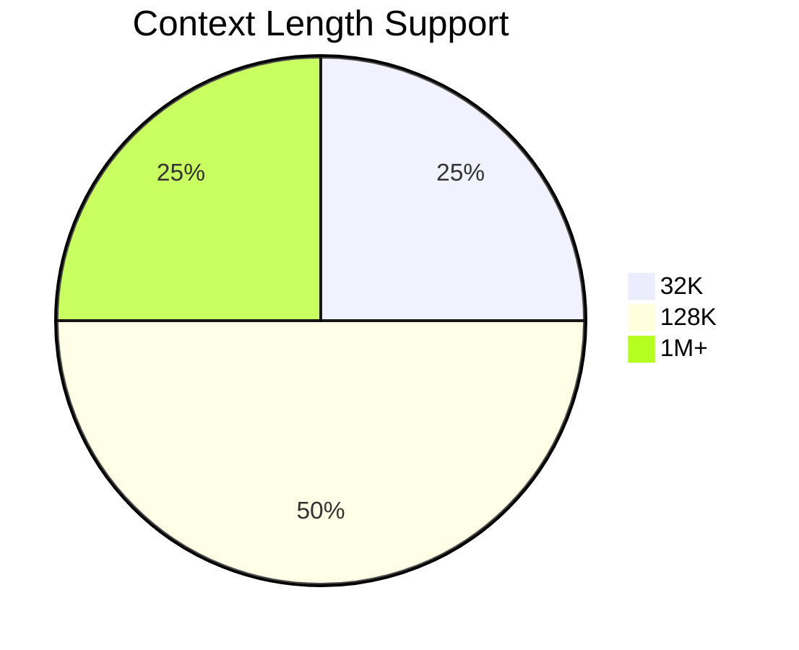

# 大模型洞察与对比

深入分析各大语言模型的诞生、演进、能力和生态

  
    Press Space for next page <carbon:arrow-right class="inline"/>
  

---

# 目录概览

<v-clicks>

- **时间线分析** - 各大模型的诞生时刻
- **演进脉络** - 技术发展的关键节点  
- **能力对比** - 多维度性能评估
- **应用生态** - 实际应用场景分析
- **未来趋势** - 大模型发展方向

</v-clicks>

---

# 时间线：大模型里程碑

<v-click>

## 关键转折点
- **2017**: Transformer 架构革命
- **2020**: GPT-3 API 时代开启  
- **2022**: 对话式 AI 爆发
- **2023**: 开源模型崛起

</v-click>

---

# 演进脉络：技术发展

## 架构演进
<v-click>

- **RNN/LSTM** → **Transformer** → **Mixture of Experts**
- **Encoder-only** → **Decoder-only** → **Encoder-Decoder**

</v-click>

## 规模演进  
<v-click>

- **参数量**: 110M → 175B → 1.7T+
- **上下文**: 512 → 4K → 128K → 1M+

</v-click>

## 训练数据
<v-click>

- **数据量**: GB → TB → PB 级别
- **数据质量**: 通用文本 → 高质量筛选 → 多模态

</v-click>

---

# 能力维度对比

| 维度 | GPT-4 | Claude 3 | Llama 3 | Gemini |
|------|-------|----------|---------|--------|
| **推理** | ⭐⭐⭐⭐⭐ | ⭐⭐⭐⭐⭐ | ⭐⭐⭐⭐ | ⭐⭐⭐⭐ |
| **编码** | ⭐⭐⭐⭐⭐ | ⭐⭐⭐⭐ | ⭐⭐⭐⭐ | ⭐⭐⭐⭐ |
| **多语言** | ⭐⭐⭐⭐ | ⭐⭐⭐⭐⭐ | ⭐⭐⭐ | ⭐⭐⭐⭐ |
| **数学** | ⭐⭐⭐⭐ | ⭐⭐⭐⭐⭐ | ⭐⭐⭐ | ⭐⭐⭐⭐ |

<v-click>

## 特色能力
- **GPT-4**: 多模态、工具调用
- **Claude 3**: 长上下文、文档理解  
- **Llama 3**: 开源、可定制
- **Gemini**: 原生多模态

</v-click>

---

# 应用生态对比

## 商业应用
<v-click>

- **OpenAI**: 企业API、Copilot、Custom GPT
- **Anthropic**: Claude for Business、文档分析
- **Meta**: Llama 商业许可、开源生态
- **Google**: Gemini集成、Workspace AI

</v-click>

## 开发者生态
<v-click>

- **OpenAI**: 最完善的工具链和社区
- **Anthropic**: 企业级安全和合规
- **Meta**: 开源社区活跃、研究友好  
- **Google**: 云平台深度集成

</v-click>

## 开源 vs 闭源
<v-click>

- **开源优势**: 透明、可定制、成本可控
- **闭源优势**: 稳定、支持、持续更新

</v-click>

---

# 多维度详细对比

## 性能指标

<v-click>

## 成本效率
- **GPT-4**: 高性能高成本
- **Claude 3**: 平衡性价比  
- **Llama 3**: 低成本高灵活性
- **Gemini**: 云服务集成优惠

</v-click>

---

# 选择建议

## 按场景选择
<v-clicks>

- **企业应用**: Claude 3 (安全合规)
- **创新实验**: Llama 3 (开源灵活)  
- **多模态**: GPT-4/Gemini
- **成本敏感**: Llama 3 + 自托管
- **快速集成**: OpenAI API

</v-clicks>

## 未来趋势
<v-clicks>

- **模型小型化**: 更高效的推理
- **多Agent协作**: 复杂任务分解
- **个性化**: 用户专属模型
- **开源主导**: 社区驱动创新

</v-clicks>

---

# 资源链接

## 官方文档
- [OpenAI Models](https://platform.openai.com/docs/models)
- [Anthropic Claude](https://docs.anthropic.com/claude)
- [Meta Llama](https://llama.meta.com)
- [Google Gemini](https://ai.google.dev/gemini-api)

## 开源资源
- [Hugging Face Model Hub](https://huggingface.co/models)
- [LMSYS Chatbot Arena](https://chat.lmsys.org)
- [Open LLM Leaderboard](https://huggingface.co/spaces/HuggingFaceH4/open_llm_leaderboard)

## 评估基准
- MMLU, GSM8K, HumanEval, MT-Bench

---

# Thank You!

持续更新中... 🔄

[GitHub Repository](https://github.com/teeeemoji/claw)