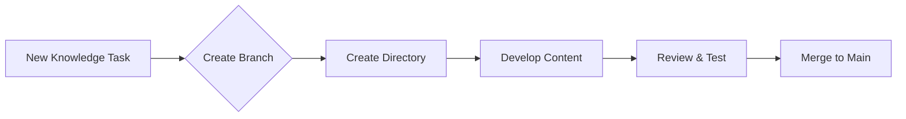

# Claw Knowledge Base

Knowledge repository for personal learning and sharing

<div class="pt-12">
  <span @click="$slidev.nav.next" class="px-2 py-1 rounded cursor-pointer" hover="bg-white bg-opacity-10">
    Press Space for next page <carbon:arrow-right class="inline"/>
  </span>
</div>

---

# Repository Structure

```tree
claw/
├── README.md
├── Rules.md
├── slides.md          # This presentation
├── presentations/     # Knowledge presentations
└── {knowledge-topic}/ # Individual knowledge tasks
```

<v-click>

## Knowledge Tasks
- Each topic in separate directory
- Lowercase kebab-case naming
- Independent development branches

</v-click>

<v-click>

## Presentations  
- Slidev for knowledge sharing
- Interactive demos and examples
- Exportable to PDF/PPTX

</v-click>

---

# Development Workflow



<v-click>

## Branch Naming
- `knowledge/task-name` for knowledge tasks
- `presentation/topic-name` for presentations

</v-click>

<v-click>

## Quality Requirements
- Clear documentation
- Working examples
- Proper testing

</v-click>

---

# Slidev Integration

## Why Slidev?
- Perfect for technical knowledge sharing
- Code highlighting and live demos
- Interactive presentations
- Easy export to multiple formats

## Getting Started
```bash
# Install dependencies
npm install

# Start development server  
npm run dev

# Build for production
npm run build

# Export to PDF
npm run export
```

---

# Knowledge Categories

<v-clicks>

- **AI/ML Applications** - Large model applications for frontend developers
- **Web Development** - Modern web technologies and best practices  
- **DevOps & Tools** - Development workflows and tooling
- **Programming** - Language-specific knowledge and patterns
- **Personal Notes** - Personal insights and learnings

</v-clicks>

---

# Contribution Guidelines

## For Knowledge Tasks
1. Create new branch: `knowledge/your-topic`
2. Create directory: `your-topic-name`
3. Add comprehensive content with examples
4. Submit for review

## For Presentations  
1. Create new branch: `presentation/your-topic`
2. Add slides to `slides.md` or create new presentation
3. Include interactive demos where applicable
4. Test export functionality

---

# Resources

## Documentation
- [Slidev Official Docs](https://sli.dev)
- [Repository Rules](./Rules.md) 
- [Knowledge Base Structure](./README.md)

## Tools
- VS Code with Slidev extension
- Browser development tools
- Git for version control

## Support
Contact the repository maintainer for questions or guidance

---

# Thank You!

Happy learning and sharing! 🎉

[GitHub Repository](https://github.com/teeeemoji/claw)